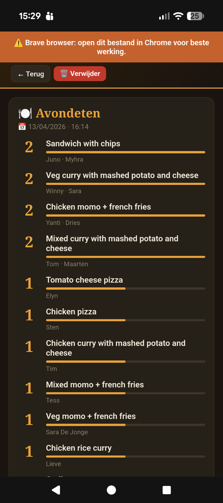
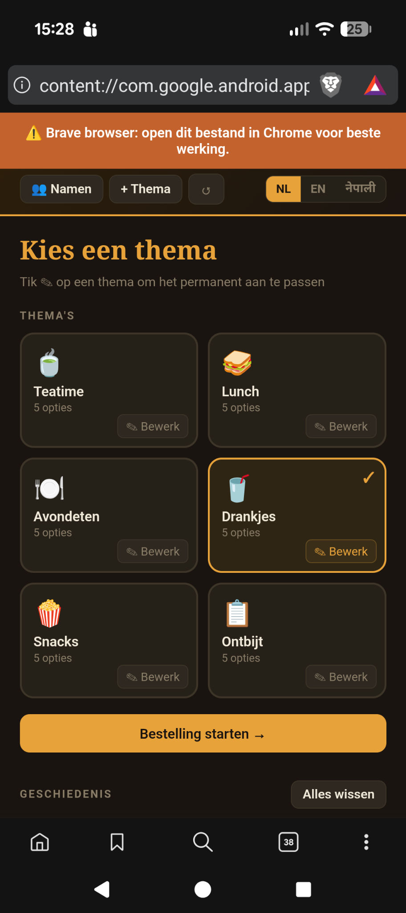

# 🍲 FoodsUp

> **Collect group orders in seconds — works offline, no account, no server.**

Everyone taps their name, picks what they want, and FoodsUp adds it all up. Made for a group trip through Nepal (18 people, lots of tea stops), and just as handy for a team lunch, a scout camp or a round at the bar.





---

## 📲 Get the app (2 minutes, no technical knowledge needed)

**Open this link on your phone: [timdams.github.io/FoodsUp](https://timdams.github.io/FoodsUp/)**, or scan:


Then put it on your home screen, so it works like a normal app, also without internet:

| Phone | What to do |
|---|---|
| **Android** (Chrome, Samsung Internet) | Tap the **Install** button in the app, or menu **⋮ → Install app / Add to Home screen**. |
| **iPhone / iPad** (Safari) | Tap the **Share** button (square with arrow ↑) → **Add to Home Screen** → **Add**. |
| **Laptop** (Chrome, Edge) | Click the install icon in the address bar. |

From then on, open FoodsUp via its icon. It keeps working offline, so it's fine on a mountain, a plane or a campsite.

> 💡 Open the link once while you still have internet. After that, no connection is needed.

Your data (names, menus, history) stays **on your own phone only**. Nothing is sent anywhere.

---

## How to use it

### First start
A short welcome asks for the names in your group (paste a whole list if you like) and which **starter pack** you want:

| Pack | Menus |
|---|---|
| 🍽️ Restaurant & day out | Coffee & tea, lunch, dinner, drinks, snacks |
| 🥖 Office lunch | Sandwiches (white or brown), drinks, coffee |
| 🍺 Round at the bar | Drinks and bar snacks |
| 🏔️ Trekking in Nepal | Tea break, breakfast, dinner (dal bhat, momos…), drinks |
| 📝 Start empty | Make your own menus |

Everything can be changed afterwards: tap **✎** on a menu to edit its choices and (optional) prices, or **＋ New menu**.

**Already have a group?** Someone can send you their setup: in **👥 Group** they tap **🔗 Share group via link**. You open the link (or paste it via **📥 Paste a link**) and get the same names and menus.

### Each round
1. Pick a menu and tap **Start order**. You can tweak the choices for this round only.
2. Tap a name and choose one or more things (use **− / +** for 2× the same). Add a note if needed (*no onions*), then **Confirm ✓**. Pass the phone on.
3. Tap **📊 Results** to see the totals (and the bill per person if you set prices), then **📤 Share** to send them (WhatsApp, Signal, email…).
4. Tap **Close round & save** to store the round in the history.

If the phone locks or the app is closed mid-round, nothing is lost: the home screen shows **Resume ▶**.

### Example of a shared summary

```
🥖 Sandwiches
02/10/2026 · 12:15

2× Coke (€ 4)
1× Cheese · Brown (€ 3,50)
1× Ham · White (€ 3,20)

Total: € 10,70

---
Ben: Ham · White (€ 3,20)
Lies: Cheese · Brown + 2× Coke — no butter (€ 7,50)
```

---

## Features

**Ordering**
- Tile grid of names; tap anyone in any order, and a checkmark shows who's done
- Pick several things, and quantities (2× tea)
- A note per person (*no onions, extra spicy*)
- Write-in option: type anything not on the list, and it becomes a button for everyone
- Sub-choices, e.g. "Sandwich → white or brown" or "Breakfast set → Coffee or Tea → Jam or Honey"
- Extra guests (porters, guides, colleagues) per round

**Menus & prices**
- Starter packs for restaurants, office lunches, the bar and trekking
- Add, rename or delete menus and their choices
- Optional prices per choice, with the total and the amount per person
- Change choices for one round, or save them as the new default

**Results & history**
- Live totals with bars and who ordered what
- History of every saved round
- Share any round, now or later

**Group**
- Group name, currency, participants (paste a list in one go)
- Share the whole setup with someone else via a link, with no server or account involved
- Download a backup file and restore it on another phone

**Languages**
- Dutch, English and Nepali (Devanagari). Picks your phone's language on first start; switch anytime.

---

## Tips

| Situation | What to do |
|---|---|
| A porter or guest wants to order | Tap **+ Guest** on the names grid |
| Someone wants two teas | Tap Tea, then **+** |
| Sandwich with white or brown bread | Edit the menu → **+ Sub-choice** on that item |
| Wrong order after confirming | Tap the name again; it's still editable |
| Accidentally went back to the home screen | Tap **Resume ▶** |
| New phone | 👥 Group → **Download backup**, then **Restore backup** on the new phone |
| iPhone and a shared link | Copy the link and paste it via 👥 Group → **📥 Paste a link** inside the installed app. Opening it in Safari puts the group in Safari, which keeps its own storage. |

---

## Technical notes

- **Plain HTML/CSS/JS**, no framework, no build step. The whole app is [`src/index.html`](src/index.html).
- **PWA**: [`manifest.webmanifest`](src/manifest.webmanifest) and a service worker ([`sw.js`](src/sw.js)) that caches the app for offline use. New versions are picked up in the background and show up the next time the app is opened. Bump `CACHE` in `sw.js` when you add or rename files.
- **Hosting**: every push to `main` deploys `src/` to GitHub Pages ([`.github/workflows/pages.yml`](.github/workflows/pages.yml)).
- **Icons**: generated by `python tools/make_icons.py` (needs Pillow).
- **Storage**: `localStorage` key `gb6`. People have stable ids (`{id, name}`); votes and notes are keyed by id, and a repeated choice in someone's vote array means quantity. Options are a string or `{label, price?, subs?}`. Old saves are migrated automatically.
- **Share links**: `#import=` followed by the base64url of the deflated setup JSON (names, menus, group name, currency). It lives in the URL fragment, which browsers never send to the server.
- **Still works as a single file**: you can open `src/index.html` directly, but some browsers (Brave, Firefox, Safari) restrict storage for `file://` pages, so the website/installed app is recommended.
- **Run locally**: `cd src && python -m http.server 8000`, then open <http://localhost:8000>.

---

*Made with Claude · Nepal 2026*
